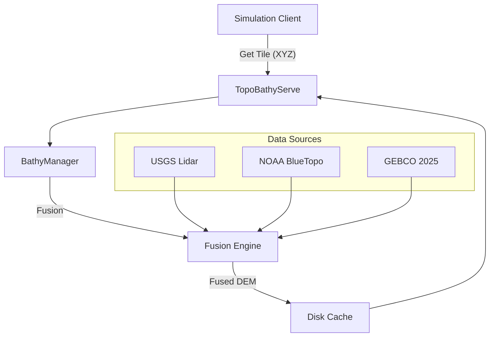

# TopoBathySim

**High-Fidelity Topobathymetric Fusion Engine for Digital Twins.**

[](https://www.python.org/downloads/)
[](LICENSE)

**TopoBathySim** is a Python library and microservice designed to generate seamless, high-resolution Digital Elevation Models (DEMs) by fusing disparate geospatial datasets. Originally developed for amphibious robotics simulations, it intelligently merges terrestrial Lidar, coastal bathymetry, and global terrain data into cohesive, unified tiles.

## Key Features

- **Multi-Source Fusion**: Automatically harmonizes data from best-available sources:
  - **Terrestrial**: USGS Lidar (via EPT/PDAL) & 3DEP (10m).
  - **Aquatic**: NOAA BlueTopo (High-Res Bathymetry) & GEBCO 2025 (Global).
- **Intelligent Blending**: Uses logistic weight functions to seamlessly merge datasets at coastlines (seamline blending), eliminating sharp artifacts.
- **Offline-First Architecture**:
  - **Asset Manifests**: Records online assets for true offline playback.
  - **Smart Caching**: Local caching of COGs, LAZ files, and tile schemes.
- **Microservice Ready**: Includes `TopoBathyServe`, a FastAPI-based tile server offering:
  - Standard XYZ interpolation (`/tiles/{z}/{x}/{y}.tif`).
  - Raw NumPy buffers (`format=npy`) for direct ingestion into physics engines (e.g., NVIDIA Warp).
- **Geodetic Accuracy**: Automated vertical datum transformation (NAVD88 ↔ LMSL ↔ WGS84) using VDatum.

## Installation

```bash
# Clone the repository
git clone https://github.com/lhzn-io/topobathysim.git
cd topobathysim

# Install using pip (Editable mode recommended)
pip install -e .
```

## Quick Start

### 1. Running the Tile Service

The topobathymetry microservice exposes fused data via HTTP.

```bash
cd service
python -m uvicorn app.main:app --host 0.0.0.0 --port 9595 --workers 4
```

*Access the viewer at `http://localhost:9595/viewer`*

### 2. Python API Usage

Use the library directly for custom analysis or data extraction.

```python
from topobathysim.fusion import FusionEngine
from topobathysim.lidar import LidarProvider
from topobathysim.bluetopo import BlueTopoProvider

# 1. Fetch Source Data
lidar = LidarProvider().fetch_lidar_from_ept(url="...", bounds=(...))
bathy = BlueTopoProvider().fetch_blue_topo(bounds=(...))

# 2. Fuse Datasets
engine = FusionEngine()
fused_dem = engine.fuse_seamline(lidar, bathy, blend_dist=20.0)

# 3. Save or Analyze
fused_dem.rio.to_raster("fused_coastline.tif")
```

## Documentation

Full documentation, including methodology and API reference, is available in the `docs/` directory.

- [Data Fusion Methodology](docs/source/methodology.rst)
- [API Reference](docs/source/api.rst)

## Architecture

TopoBathySim acts as a central broker between simulation clients (Game Engines, Simulators) and raw geospatial infrastructure (USGS/NOAA Cloud Buckets).



## License & Acknowledgements

This project uses data and methodologies from:

- **csdms/bmi-topography**: This library relies heavily on the `bmi-topography` package for standardized data fetching. A special thanks to the CSDMS community.
  > **Note**: This project has a potential fragility regarding `bmi-topography` versions. Please ensure compatibility when upgrading.
- **USGS 3DEP & CoNED**: Adaptive Topobathymetric Fusion logic.
- **NOAA**: BlueTopo & VDatum.
- **GEBCO**: The General Bathymetric Chart of the Oceans.

Released under the MIT License.
