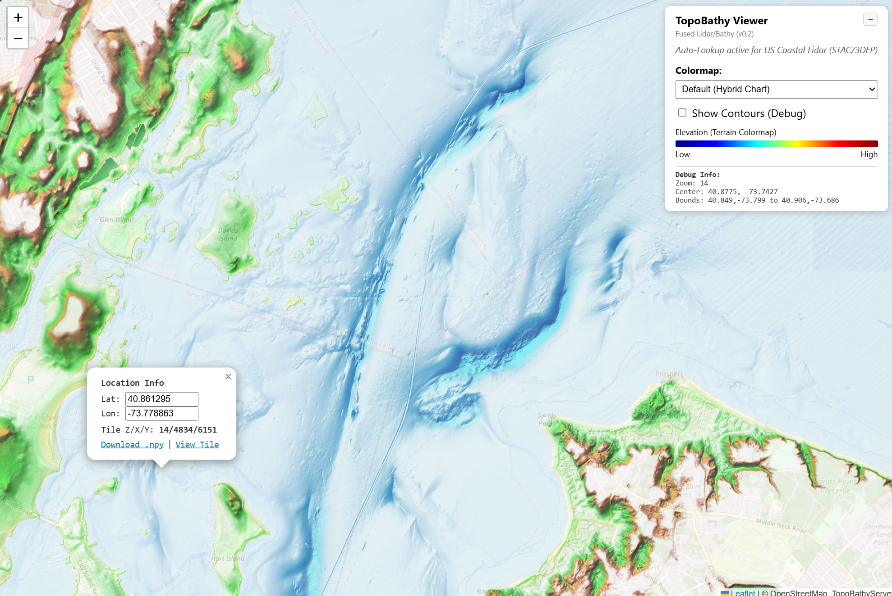

# TopoBathySim

[](https://www.python.org/downloads/)
[](LICENSE)



**Policy-driven topobathymetric fusion runtime for data-first digital worlds.**

TopoBathySim fuses heterogeneous elevation sources (global bathymetry, global land DEMs, and optional high‑resolution regional datasets) into seamless, analysis- and simulation-ready grids. It produces **data-first outputs** (`xarray.Dataset`) with **per-pixel provenance** (source masks), and optionally serves the same products over HTTP for real-time clients.

- Primary output: **arrays + provenance**, not pretty pictures
- PNG tiles and the viewer are **debug/QA tools** (seams, datum issues, coverage), not the product
- Fusion behavior is defined by **YAML policy presets** you can edit and share

## What you can do

- **Generate a fused DEM anywhere** from a global basemap policy (coarse but robust) with clear provenance.
- **Overlay regional high-resolution datasets** (e.g., GBR100) on top of the basemap and blend edges smoothly.
- **In data-rich coastal regions**, prioritize “survey truth” (e.g., BAG / topobathy lidar) over compiled products, while retaining global fallbacks.
- **Run a local tile/data service** for Unity/Unreal/Omniverse workflows:
  - request fused elevation grids for simulation
  - visualize seams and provenance in the viewer for QA

## Core concepts

### 1) Providers

A *provider* fetches a dataset layer (elevation or covariate), normalizes CRS/metadata, caches locally, and returns an `xarray.DataArray`.

Providers can be global (e.g., GEBCO + global land DEMs), regional compiled products (e.g., BlueTopo), or local high-resolution surveys (e.g., BAG, topobathy lidar). Adding a provider is the main contribution pathway.

### 2) Policies (YAML)

A *policy* is a YAML file that defines **per-variable fusion strategies**:

- which providers participate
- how to **overwrite in trusted zones**
- how to **blend in transition zones**
- fallback order for gap filling
- required outputs (e.g., source masks)

Policies are selected by **filename**, so you can keep policy presets in the repo (or your own project) and share them easily.

### 3) Operators

An *operator* is a pure, testable transformation used by policies (e.g., seamline feathering in meters for smooth edges).

### 4) Provenance (first-class)

Every fused variable includes a source mask (e.g., `source_elevation`) identifying the contributing provider for each pixel. Provenance is how you debug seams and validate that “truth” data really won.

## Data sources and built-in providers

TopoBathySim includes a growing catalog of dataset providers. The current set reflects our initial focus on the **Northeast US** (where we have dense public coastal survey coverage). We warmly welcome contributors adding providers and policy presets for the EU, Asia-Pacific, and other regions.

### Global basemap (worldwide)

- **GEBCO 2025** (global topo+bathy baseline)
- **Global land DEMs via STAC** (e.g., Copernicus DEM / NASADEM where available)

### Regional compiled bathymetry (mostly US coastal)

- **NOAA BlueTopo™** (compiled best-available bathymetry for US waters)
- **NOAA CUDEM (Ninth Arc-Second Topobathy)** (regional integrated tiles; useful as a coastal gap-filler)

### Local high-resolution “truth” layers (survey / lidar)

These layers are typically prioritized *where they exist* and may overwrite compiled products.

- **NOAA NCEI BAG (Bathymetric Attributed Grids)**
  High-resolution multibeam/sonar survey grids. When present, these are treated as “survey truth” for bathymetry.

- **NOAA Topobathymetric Lidar (green lidar)**
  Nearshore shallow-water bottom mapping (intertidal/subtidal) that complements airborne topographic lidar.

- **USGS 3DEP / coastal lidar (topography)**
  High-resolution land elevation, often used to mask water noise and sharpen the land–water interface.

See `docs/source/data_sources.rst` for citations and acknowledgements.

## Quick start (library)

Install (editable is recommended for development):

```bash
git clone https://github.com/lhzn-io/topobathysim.git
cd topobathysim
pip install -e .
```

Fuse elevation for a bounding box using a policy preset:

```python
from topobathysim.runtime import run

# bbox = (west, south, east, north)
ds = run(
    policy_path="policies/global_default.yaml",
    bbox=(-74.05, 40.65, -73.70, 40.95),
    variables=["elevation"],
)

print(ds)
# ds["elevation"] -> float grid
# ds["source_elevation"] -> per-pixel provider id
```

Write a GeoTIFF (elevation only):

```python
import rioxarray  # noqa: F401  (ensures .rio accessor)
ds["elevation"].rio.to_raster("fused_elevation.tif")
```

## Quick start (service)

Run the server:

```bash
python service/run_server.py --host 0.0.0.0 --port 9595 --workers 4
```

Open the viewer:

- <http://localhost:9595/viewer>

Use the viewer to:

- inspect seams and coverage
- switch to **provenance/source** view
- verify that the policy is doing what you expect

For cache sizing and practical runtime expectations, see the documentation page: `docs/source/performance.rst`.

## Policy preset gallery

Policy presets live in `policies/`:

- `policies/global_default.yaml`
  Global basemap fusion (coarse but robust). Good for quick demos and worldwide coverage.

- `policies/iconic/great_barrier_reef.yaml`
  Demonstrates how to overlay a high-resolution regional dataset (GBR100) on top of the global basemap and feather edges smoothly.

- (Northeast US) presets
  Examples that prioritize BAG + topobathy lidar + BlueTopo/CUDEM where available.

See `policies/README.md` for details, expected coverage, and suggested bounding boxes.

## Output contract (data-first)

TopoBathySim’s canonical output is an `xarray.Dataset`:

- `elevation` (`y`, `x`) — fused elevation/depth in meters
- `source_elevation` (`y`, `x`) — integer source mask (provider ID per pixel)

Metadata is attached at the dataset and variable level, including:

- `policy_hash` (stable hash of the YAML policy)
- provider legend (mapping source IDs to provider names)
- CRS and vertical reference assumptions

## International-friendly by design

TopoBathySim is global-first: you can run it anywhere with the global basemap policy.

Some datasets and datum transformations are region-specific. When vertical datum or reference is ambiguous, TopoBathySim surfaces this explicitly in metadata and provenance rather than hiding assumptions.

## Contributing

### Add a provider (best first contribution)

- Implement the Provider interface (fetch → normalize → cache → return DataArray + metadata).
- Add a policy preset that uses your provider.
- Add/update docs and citations.

If you’re outside the US: we would especially value providers and policy presets for:

- national hydrographic office products
- EMODnet / Copernicus Marine / regional lidar catalogs
- local survey archives and higher-update-frequency coastal products

### Add a policy preset

If you have domain expertise for a region, you can encode it as a policy preset:

- overwrite in trusted zones
- blend at edges
- fill gaps in a sensible order
- publish provenance expectations

## Documentation

- `docs/source/` — API, methodology, CLI tools
- `docs/planning/roadmap.md` — roadmap (including time-varying covariates and Sentinel plans)
- `policies/README.md` — policy presets and how to run iconic demos

## License

MIT License (code).
Datasets are provided by third parties under their respective terms; see `docs/source/data_sources.rst` and provider metadata for citations and licensing notes.
