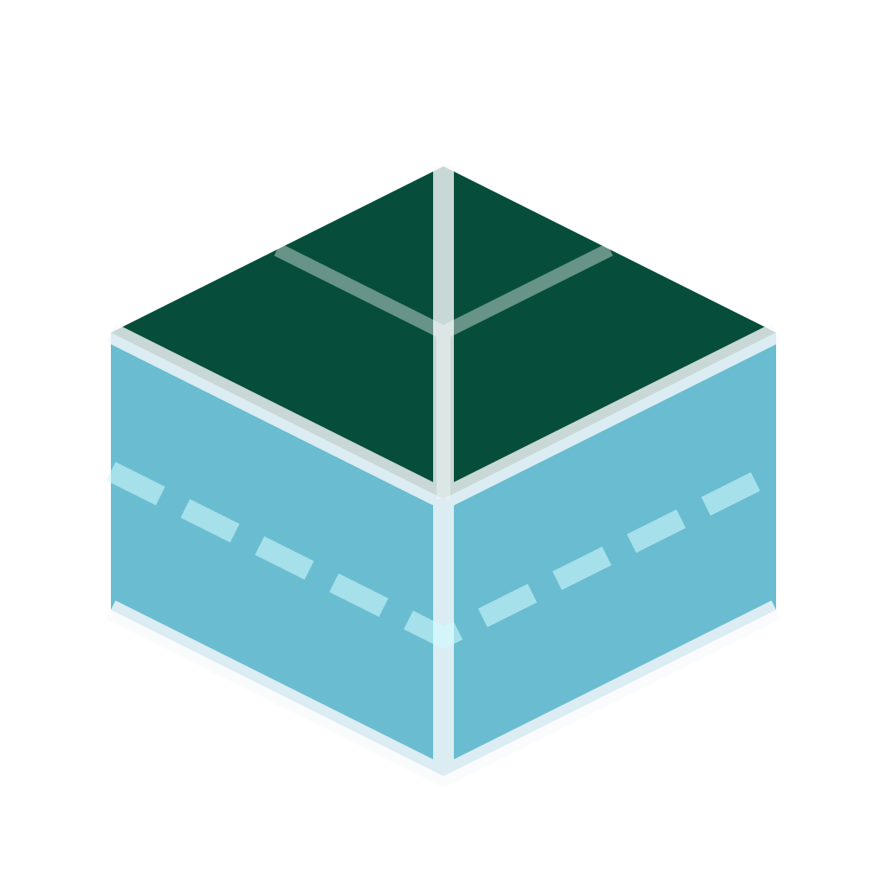

#  TopoBathySim

**High-Fidelity Topobathymetric Fusion Engine for Digital Twins.**

[](https://www.python.org/downloads/)
[](LICENSE)


**TopoBathySim** is a policy-driven geospatial fusion engine designed to generate seamless, high-resolution Digital Elevation Models (DEMs). It intelligently merges terrestrial Lidar, coastal bathymetry, and global terrain data into cohesive tiles based on configurable **Fusion Policies**.

## Key Features

- **Policy-Driven Runtime**: Define your fusion logic (sources, priorities, blending operations) in simple YAML files.
- **Multi-Source Support**:
  - **Survey Data**: NOAA BAG (Bathymetric Attributed Grids).
  - **Lidar**: USGS 3DEP & NOAA Topobathy.
  - **Regional/Global**: NOAA BlueTopo™, NOAA CUDEM, GEBCO 2025.
- **Smart Caching**:
  - **Lazy Network Loading**: Only fetches data when needed.
  - **Zarr-Based Storage**: High-performance local caching for repeated access.
- **Microservice Ready**: `TopoBathyServe` (FastAPI) provides XYZ tiles and raw NumPy buffers for physics engines.

## Installation

```bash
git clone https://github.com/lhzn-io/topobathysim.git
cd topobathysim
pip install -e .
```

## Quick Start

### 1. Running the Tile Service

Start the server with a specific fusion policy (defaults to US Coastal / WLIS):

```bash
# Set policy and run
TOPOBATHY_POLICY=policies/examples/wlis.yaml python service/run_server.py
```

Access the viewer at `http://localhost:9595/viewer`.

### 2. Python API Usage

Directly invoke the runtime to generate data for a specific bounding box.

```python
from topobathysim.runtime import run

# Run fusion for a specific bounding box (West, South, East, North)
ds = run(
    policy_path="policies/examples/wlis.yaml",
    bbox=(-73.85, 40.92, -73.80, 40.95),
    resolution=10.0  # Meters
)

# Save result
ds.rio.to_raster("fused_output.tif")
```

## Documentation

Full documentation is available in the `docs/` directory.

- [Policy DSL Guide](docs/source/policy_dsl.rst): Learn how to write fusion policies.
- [Runtime Architecture](docs/source/runtime_architecture.rst): Understanding the engine.
- [Data Sources](docs/source/data_sources.rst): Supported providers.

## Architecture

TopoBathySim uses a stateless, policy-driven runtime to compose data on the fly.

```mermaid
graph TD
    User["User / API"] -->|Request (BBox + Policy)| Runtime[Runtime Engine]

    subgraph "Providers"
        L["USGS Lidar"]
        B["BlueTopo"]
        G["GEBCO"]
        S["Survey (BAG)"]
    end

    Runtime -->|Fetch & Cache| Providers
    Runtime -->|Reproject & Resample| Canvas["Unified Canvas"]

    Canvas -->|Blend (Metric Feather)| Output["Fused DEM"]
```

## License

Released under the MIT License.
