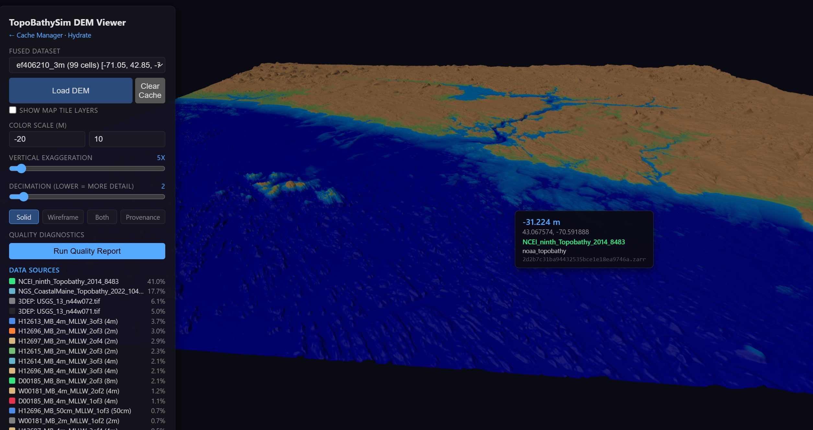
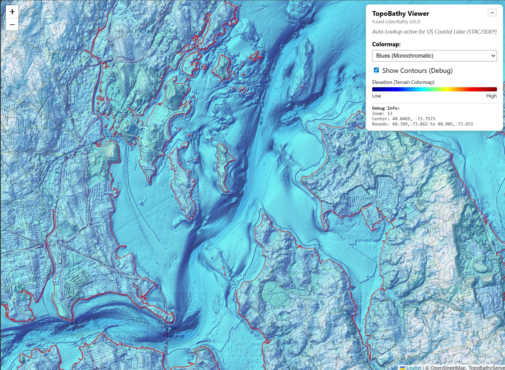
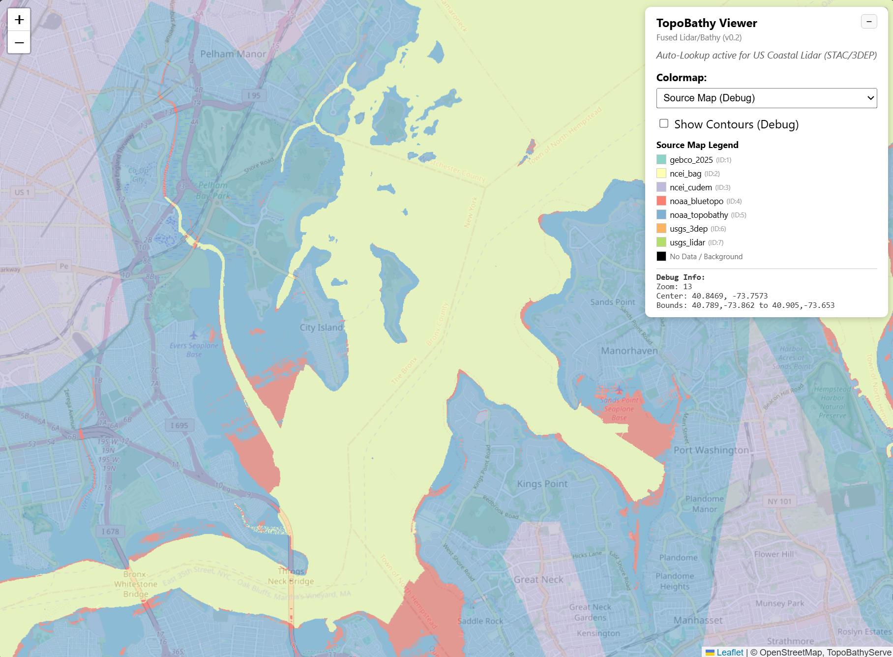
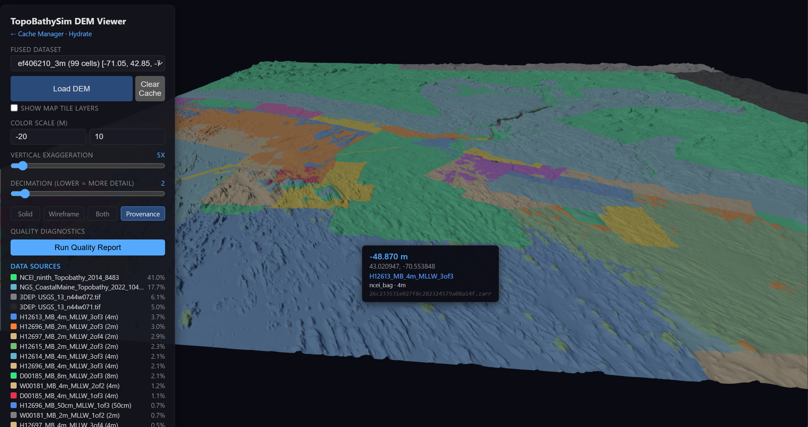
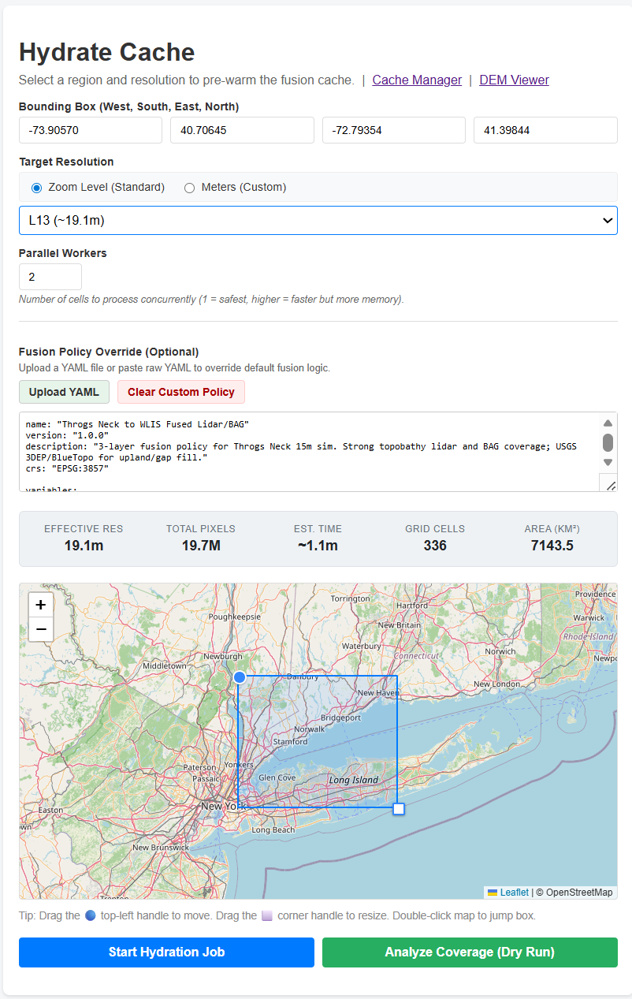

Visual Gallery
==============

This gallery showcases the visual output of the TopoBathySim fusion process, provenance tracking, and debugging tools. Note that there are two primary ways to visualize fused data: the **3D DEM Viewer** for arbitrary resolution exploration and the **2D Map Tile Viewer** for standard web-map navigation.

.. contents::
   :local:
   :depth: 2

3D DEM Visualization (High-Resolution)
--------------------------------------

The 3D DEM Viewer is designed for detailed inspection of terrain continuity and resolution transitions. Unlike the tile viewer, it can render arbitrary resolution grids directly from the fusion runtime, making it the primary tool for debugging high-precision surveys.

   *High-fidelity 3D perspective of fused topobathymetric surfaces.*

2D Map Tile Viewer (Debug & QA)
-------------------------------

The standard Map Tile Viewer provides a familiar 2D interface for navigating fused products. It is strictly 2D and serves standard XYZ tiles, but includes powerful debugging features such as **hillshading**, **contour overlays**, and a **red zero-elevation line** to identify the precise intertidal boundary.

.. figure:: _static/topobathyscreenshot.png
   :alt: 2D Map Tile Viewer
   :align: center
   :width: 800px

   *The 2D Tile Viewer featuring hillshading and the zero-elevation coastline (red line).*

   *Detailed contour overlays and hillshading used to validate cross-source seam continuity.*

Data Provenance & Source Mapping
--------------------------------

One of TopoBathySim's core strengths is "Provenance-First" fusion. We track exactly which data source contributed to each pixel in the final grid.

   *A typical fusion scenario where high-resolution LIDAR (green) is blended into coastal surveys (blue), with global basemaps (red/brown) filling the gaps.*

Provenance Metadata inspection
------------------------------

The viewer allows for per-pixel inspection of metadata, including the source database, survey date, and vertical datum transformation details.

   *Per-pixel metadata inspection showing source database and transformation details.*

Cache Hydration Utility
-----------------------

To ensure snappy performance in the 3D viewer, the Hydrate page allows users to pre-warm the fusion cache for specific regions and resolution tiers.

   *The hydrate utility used to pre-warm fusion caches for specific geographic bounds.*
